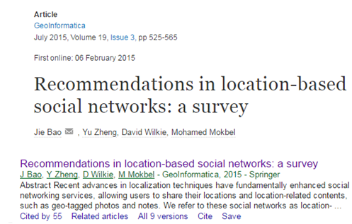

## 文章背景  

 
15年的文章 55引用量  

## 文章内容

### 基于社交网络的定位的定义  

### 基于社交网络定位的影响  

### 定位的唯一属性
 
分层  
距离属性  
顺序属性  

### LBSN推荐系统的挑战  
`Location Context Awareness定位内容感知`  
用户不同级别分层（a relatively coarse granularity醋粒度的推荐给新用户  ）
距离属性的可能性  
序列影响的属性  
`考虑用户本人的历史记录影响和其他用户的历史记录的影响（推测的依据)`

### Heterogeneous Domain异构域

### 增长比例

### 冷启动和空间数据

### 近来的文章
 
 
这里面包含了类似的很多文章

## Categorization by Objectives分类目标

### Stand-alone推荐系统
 
利用：  

- 1、  User profiles用户属性  
- 2、  定位历史记录

#### 代表性研究

> Ye et al. 2011 [112]

出了一种推荐系统，该系统使用融合多个因素：   

- 用户的喜好
- 用户的社交关联
- 用户和备选的距离
- 建立了这么一个三者的相关的关联模型
 
> Liu建立了一种模型集成：

考虑由于地理人气和Toblers的第一定律的影响的签到记录的影响；一些潜在因素在推荐系统给出推荐排名是在LBSN签到行为的特性。
 分析了利用轨迹数据挖掘的几个优点。  
 
> Zheng建立的模型利用了模型：
 
基本思想是用户访问的地点被其他用户采纳过，用户的旅行轨迹和定位兴趣相关，这个感兴趣的定位就会被引导预测。距离假设在纽约的人发布说他想去的地点是在北京，使用最高可能的n个最感兴趣点的推测的

## 顺序的地理位置推荐

### 相关的研究

- 用户社交媒体内容能被用来地理位置推荐

> 【102,63】

作者建立一个路线推理框架 构建不确定轨迹的热门航线。  
给定一个位置序列和时间跨度，构建的最高等级的K个路径通过聚集不确定的轨迹，在一个相互加强的方式。
同样也谈到了挖掘GPS轨迹

> [121,122,133]

建立离线的模型：利用兴趣点和访问频率  
在线推荐系统：获取用户的请求，开始和结束的位置，时间和一些列定位。然后计算出推荐的点。
 
- 时空属性的分析用户的顺序定位  

#### 代表性的研究

Cho et 支出了长距离的旅行更容易被社交网络影响包括他们的时间和空间特性。提出了PMM和PSMM模型去预测  
PMM通过时间去预测一天不同的时间在不同的点  
PMMS模型通过增加用户的社交联系的因素来提高以往模型的效果

## 用户推荐系统  
集中在两块:

- 受欢迎的用户发现和朋友推荐
- 相关研究：

> Zheng  2011 Ulrike Von Luxburg. A tutorial on spectral clustering. Statistics and computing, 17(4):395–416, 2007

交流探索
传统的交流是集群用户有这类似结构，随着定位信息的可用LBSN的扩张类似位置的用户沟通。

> Xiao 2012  
134. Yu Zheng, Lizhu Zhang, Zhengxin Ma, Xing Xie, and Wei-Ying Ma. Recommending friends and
locations based on individual location history. ACM Transactions on the Web (TWEB), 5(1):5, 2011.  
> Nina Mishra, Robert Schreiber, Isabelle Stanton, and Robert E Tarjan. Clustering social networks. In
Algorithms and Models for the Web-Graph, pages 56–67. Springer, 2007  
Yanhua Li, Zhi-Li Zhang, and Jie Bao. Mutual or unrequited love: Identifying stable clusters in social
networks with uni-and bi-directional links. In Algorithms and Models for the Web Graph, pages 113–
125. Springer, 2012.

分层用户分为不同的组通过相似的方法。  
定位信息的利用可以发现，当一个新用户和组内有相似的兴趣。  
作者发现用户共享：  
一个附近的语义定位，一个长距离的定位，不那么流行的语义位置将会对其他人更加熟悉
 

## 推荐系统的举动

- 基于个体退推论的方法
- 基于协作学习的方法
- 
### 代表研究：
1.定位活动的特征矩阵  
2.位置属性的特征矩阵  
3.活动活动的特征矩阵  
 
### 社交媒体推荐

## 分类方法：

### 基于内容推荐

### 链接分析推荐

### 协同过滤的推荐

#### 备选的选择

#### 类似的属性

#### 推荐的评分预测

### 通过数据源的分类

#### 用户信息

#### 用户在线历史

#### 用户定位历史

### 表现评级

#### 数据源：
 
介绍了这几个数据源的来源和数据集的内容。
评级方法：
 
## 将来的工作

### 推荐系统的效果问题

- 区分选择不同的数据源
- 多种方式并发的使用
- 社交内容的分析

### 推荐系统的效率

- 用户的移动性
- 用户更新的频率

## 结论
References  工具书类里面很多文章比如上述有些没细看的研究可以找到。  
确实综述的内容多，可以大范围的汲取信息。  
看完综述可以发现有很多内容相关的研究那部分的文章可以继续深挖下去看。
